<!-- README for github.com/kailash105/kailash105 -->
<div align="center">
  
  <br/><br/>
  <a href="https://kailashk.com"></a>
  <a href="https://www.linkedin.com/in/khadarabad-kailash/"></a>
  <a href="https://orcid.org/0009-0003-2368-488X"></a>
  <a href="mailto:kailashkbc2@gmail.com"></a>
  <br/><br/>
  <a href="#-selected-work">Projects</a> &nbsp;·&nbsp; <a href="#-research--publications">Research</a> &nbsp;·&nbsp; <a href="#-toolbox">Stack</a> &nbsp;·&nbsp; <a href="#-github-pulse">Activity</a> &nbsp;·&nbsp; <a href="#-currently-exploring">Now</a>
</div>

---

### `$ cat about.md`

I'm **Kailash Khadarabad**, a **Software Development Engineer I** at **Vassar Labs**, based in Hyderabad. I build across **Python backends, full-stack products, and applied AI/ML**, with an interest in systems that are not just impressive in demos but dependable in the real world.

- 🎓 **B.Tech, Computer Science (AI & ML)** · Mohan Babu University, 2026
- 🧪 **Two IEEE conference publications** · Hardware security and phishing URL detection
- 🛠️ Work across **React, Next.js, FastAPI, Python, databases, and deployment**
- 🧭 Exploring **RAG reliability, retrieval noise, evaluation, and evidence verification**
- 🚢 I enjoy taking ideas from **prototype → deployed product**

```python
class Kailash:
    role = "Software Development Engineer I"
    focus = ["Python", "Backend Engineering", "AI/ML", "Reliable RAG"]
    values = ["Build", "Measure", "Verify", "Ship"]

    def next_step(self):
        return "Make useful software more reliable."
```

## 🧩 Selected work

<table>
<tr>
<td width="50%" valign="top">

### 🧠 AI Workflow Builder
A visual node-based workflow editor with reusable custom nodes, dynamic variable handles, and **FastAPI DAG validation**.

**Stack:** React Flow · React · Python · FastAPI

[**Repository ↗**](https://github.com/kailash105/ai-workflow-builder) · [**Demo ↗**](https://ai-workflow-builder-three.vercel.app)
</td>
<td width="50%" valign="top">

### 🌾 Agro-AURA
Agriculture-focused machine learning project exploring wheat disease detection with computer vision.

**Area:** ML · Computer Vision · Agriculture

[**Repository ↗**](https://github.com/kailash105/Agro-AURA)
</td>
</tr>
<tr>
<td valign="top">

### 🔐 RBAC System
Role-based access control application showcasing authentication and authorization flows.

**Stack:** Next.js · Web authentication

[**Live app ↗**](https://rbac-system-delta.vercel.app)
</td>
<td valign="top">

### ⛽ Gas Station Management
A deployed management application built with React and Firebase.

**Stack:** React · Firebase

[**Live app ↗**](https://gas-station-app-v2.web.app)
</td>
</tr>
<tr>
<td valign="top">

### 🎓 TechProjectsHub
A web platform for student technology projects and related services.

**Area:** Full-stack web · Product development

[**Website ↗**](https://www.techprojectshub.in)
</td>
<td valign="top">

### 🎉 Infinity Moments
A live website built for an events business.

**Area:** Frontend · Client delivery

[**Website ↗**](https://www.theinfinitymoments.com)
</td>
</tr>
</table>

<details>
<summary><b>🔎 More engineering work: applied AI, GIS, and autonomy</b></summary>
<br/>

| Work | What I worked on |
|:---|:---|
| **Hardware Trojan detection** | Random Forest / XGBoost-based detection and localization for Verilog designs; graph-based analysis on Trust-Hub benchmark circuits. |
| **Railway route alignment & DPR automation** | Solution design and terrain / chainage profiling concepts, including cut-and-fill and gradient analysis. |
| **GIS dashboards** | Frontend work and integrations for geospatial dashboards in a professional setting. |
| **KRAFTON AI Autonomy Hackathon** | Autonomous navigation-agent experimentation, simulation evaluation, and test-driven iteration. |
| **Federated learning for healthcare** | Privacy-aware distributed model-training exploration. |

> Some professional work is proprietary; descriptions are intentionally high-level.
</details>

## 📚 Research & publications

<table>
<tr><th align="left">Publication</th><th align="left">Venue / Link</th></tr>
<tr><td><b>Hardware Trojan Detection and Localization in Verilog Designs for Renewable Systems</b><br/>Detection and localization of hardware threats in digital designs.</td><td>IEEE ICEARS 2026<br/><a href="https://doi.org/10.1109/ICEARS67481.2026.11416567">DOI ↗</a></td></tr>
<tr><td><b>Empirical Assessment of State-of-the-Art Machine Learning Methods for Malicious and Phishing URL Detection</b><br/>Comparative assessment of ML approaches for malicious URL detection.</td><td>IEEE ICDSAAI 2026<br/><a href="https://ieeexplore.ieee.org/document/11505192">IEEE Xplore ↗</a></td></tr>
</table>

<details>
<summary><b>🧪 Current research direction: When does retrieval make RAG worse?</b></summary>
<br/>

I'm investigating **retrieval-augmented generation under noisy or misleading evidence**, especially:

- **Semantic interference:** highly similar but incorrect retrieved passages
- **Retrieval-noise thresholds:** when RAG underperforms a no-retrieval baseline
- **Evaluation:** accuracy, factuality, faithfulness, and failure cases
- **Mitigations:** reranking and evidence verification

The goal is to produce reproducible reliability curves and practical evaluation guidance. This is an **ongoing research direction**, not a claim of published results.
</details>

## 🛠 Toolbox

<div align="center">

**Languages, backend & web**


**Data, AI & infrastructure**


</div>

<details>
<summary><b>⚙️ Additional tools and concepts</b></summary>
<br/>

`RAG` · `FAISS` · `LangChain` · `LangGraph` · `LLM APIs` · `REST APIs` · `JWT` · `Vite` · `CI/CD` · `GeoServer` · `Leaflet` · `XGBoost` · `scikit-learn`
</details>

## 📈 GitHub pulse

<div align="center">
  <a href="https://github.com/kailash105">
    
  </a>
  <a href="https://github.com/kailash105?tab=repositories">
    
  </a>
  <br/>
  
  <br/>
  
</div>

<sub>These cards are supplied by third-party open-source services. GitHub API rate limits or service outages may temporarily affect their rendering.</sub>

## 🎯 Currently exploring

```text
[01] Reliable retrieval & evidence verification for RAG
[02] Python/FastAPI backend architecture and testing
[03] Agentic workflows and autonomous decision systems
[04] Building practical AI products people can actually use
```

<details>
<summary><b>🌍 Beyond the terminal</b></summary>
<br/>

I like research, strength training, building independent products, and football. Portugal supporter 🇵🇹.
</details>

---

<div align="center">
  <b>Build thoughtfully. Verify rigorously. Ship something useful.</b>
  <br/><br/>
  <a href="https://kailashk.com">Portfolio</a> · <a href="https://www.linkedin.com/in/khadarabad-kailash/">LinkedIn</a> · <a href="https://orcid.org/0009-0003-2368-488X">Research profile</a> · <a href="mailto:kailashkbc2@gmail.com">Email</a>
  <br/><br/>
  
</div>
